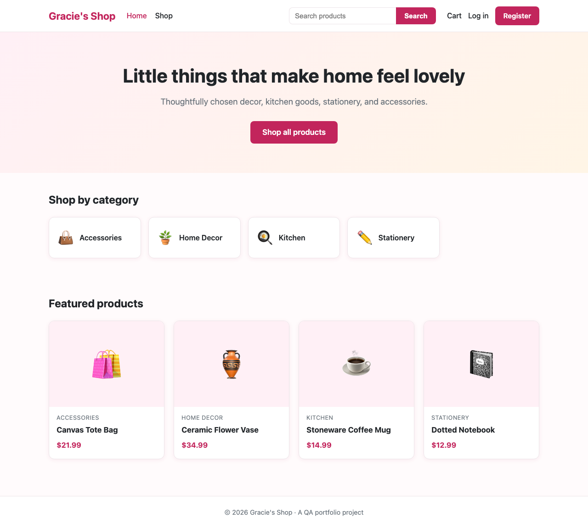
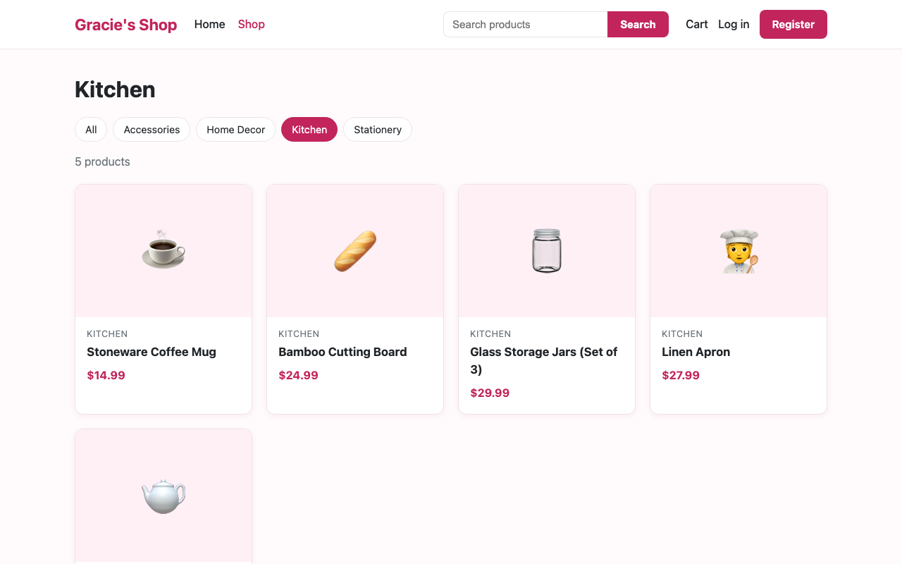
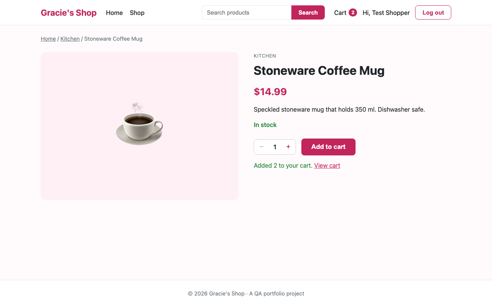
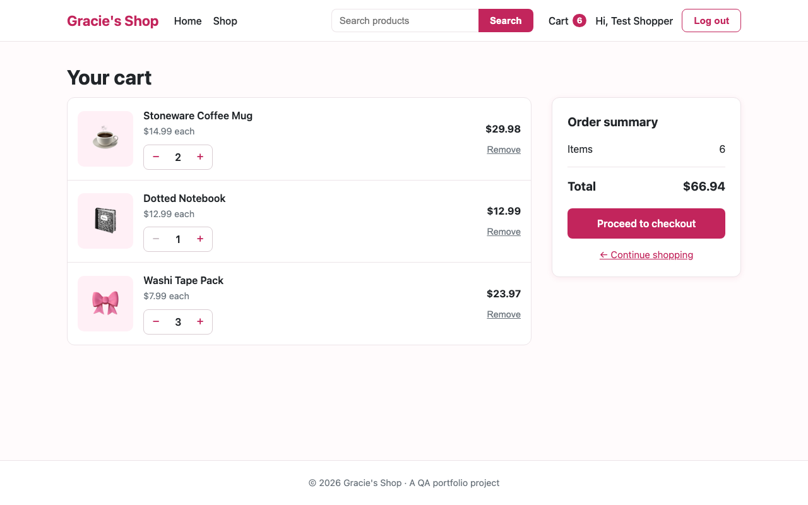
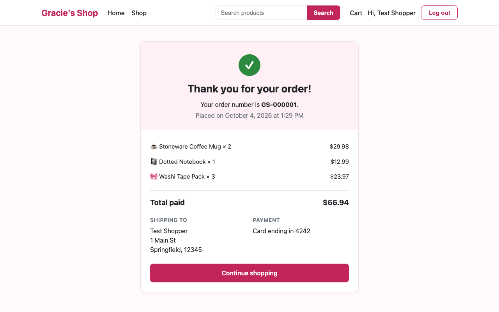
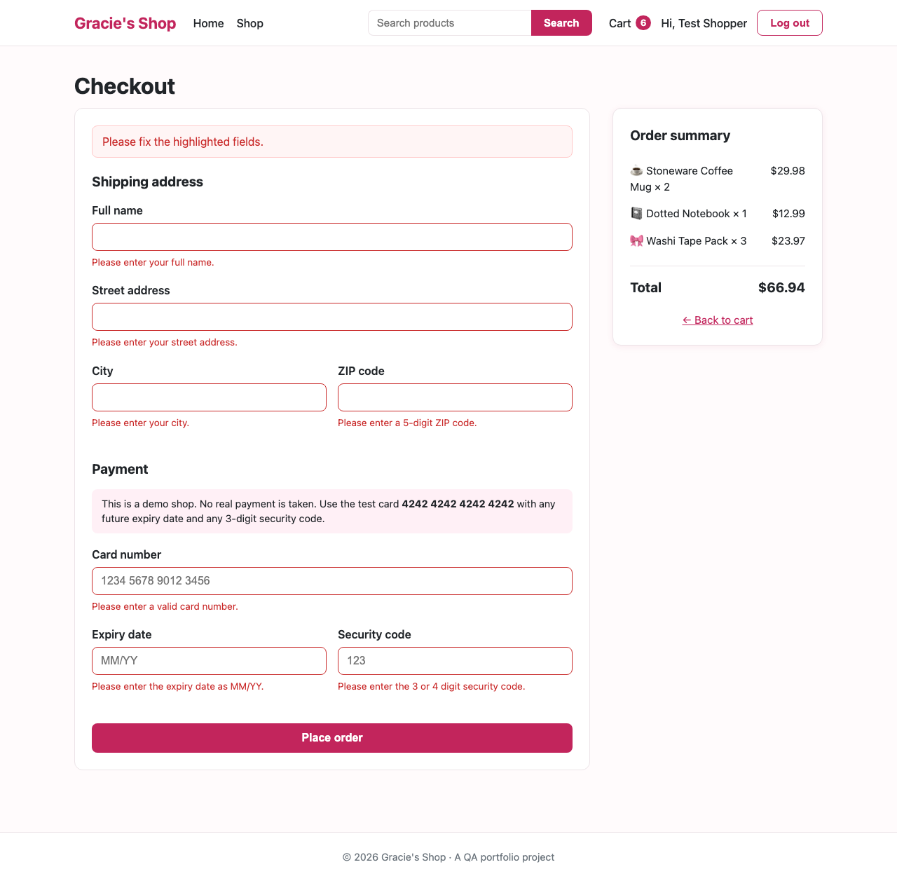
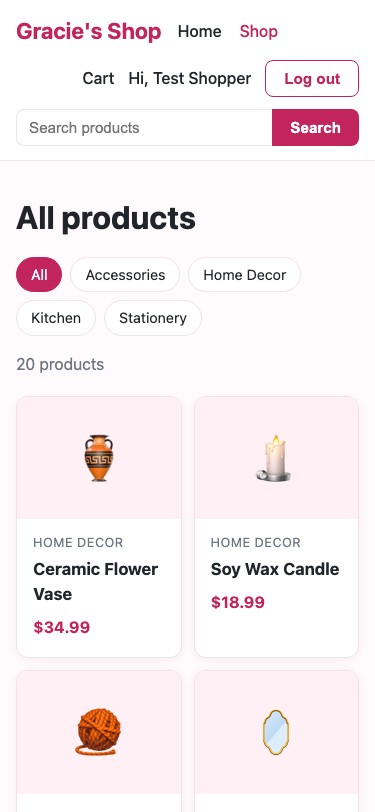

# Gracie's Shop

A small e-commerce web application, built and then tested end to end as a QA portfolio project by **Gracie Bhandari**.



## Project Status

| Area | Status |
|---|---|
| Application (all Version 1 features) | ✅ Complete |
| Test plan, scenarios, test cases (123), test data | ✅ Complete |
| Automated UI tests (17, Playwright) | ✅ 17 of 17 passed |
| Automated API tests (32, Playwright) | ✅ 32 of 32 passed |
| Bug reports | ✅ 1 open defect ([BUG-001](qa/bug-reports/BUG-001.md)) |
| Manual test execution | ⏳ **In progress.** Not yet started. All 123 cases are "Not run". |
| Test execution report | ⏳ In progress. Automated results recorded; manual results pending. |

---

## Table of Contents

- [Project Ownership and Use of AI](#project-ownership-and-use-of-ai)
- [About the Project](#about-the-project)
- [Features](#features)
- [Screenshots](#screenshots)
- [Tech Stack](#tech-stack)
- [Project Structure](#project-structure)
- [Getting Started](#getting-started)
- [QA Approach](#qa-approach)
- [Test Documentation](#test-documentation)
- [Automated Tests](#automated-tests)
- [Defects Found](#defects-found)
- [What I Learned](#what-i-learned)
- [Author](#author)

---

## Project Ownership and Use of AI

This project is owned and directed by **Gracie Bhandari**. I used **Claude Code** (Anthropic's AI coding assistant) as a development assistant throughout.

| Who | What they did |
|---|---|
| **Gracie Bhandari** (owner, QA lead) | Defined the project goals, features, and Version 1 scope. Approved the technology stack. Directed the work phase by phase and reviewed and approved each phase before it was committed. Reviewed the test plan, test cases, and automation. Triaged BUG-001 and decided to defer the fix. **Performs the manual test execution.** |
| **Claude Code** (AI assistant) | Wrote the application code, drafted the QA documents, and wrote and ran the automated tests at Gracie's request. Explained each step so Gracie could learn from and review the work. |

Commits made with AI assistance include a `Co-Authored-By: Claude` line, so the history shows this openly.

## About the Project

Gracie's Shop is an online store where users can browse products, search and filter by category, manage a shopping cart, create an account, and place an order.

The project has two goals:

1. **Build** a small, realistic web application.
2. **Test** it the way a QA engineer would: plan the testing, write test cases, run them manually, report real defects, and automate key user journeys at both the UI and the API level.

## Features

- [x] Home page
- [x] Product catalog
- [x] Product categories
- [x] Product search
- [x] Product details with stock status
- [x] Shopping cart (add, remove, change quantity, total calculation)
- [x] User registration and login
- [x] Checkout with form validation
- [x] Order confirmation
- [x] Responsive design (mobile, tablet, desktop)

## Screenshots

Captured from the running application.

| Catalog (category filter) | Product details |
|---|---|
|  |  |

| Shopping cart | Order confirmation |
|---|---|
|  |  |

| Checkout validation | Mobile (375 px) |
|---|---|
|  |  |

## Tech Stack

| Layer | Technology |
|---|---|
| Frontend | HTML, CSS, JavaScript (no framework) |
| Backend | Node.js, Express |
| Database | SQLite (Node's built-in `node:sqlite`) |
| Authentication | Sessions (`express-session`), passwords hashed with bcrypt |
| UI and API test automation | Playwright |
| Documentation | Markdown |

## Project Structure

```
├── server/                 # Backend: Express API, database, routes
├── public/                 # Frontend: HTML pages, CSS, JavaScript
├── qa/                     # QA documentation
│   ├── test-plan.md
│   ├── test-scenarios.md
│   ├── test-cases/         # 123 test cases, grouped by priority
│   ├── test-data/
│   ├── manual-test-execution.md
│   ├── test-execution-report.md
│   ├── automation-report.md
│   └── bug-reports/
├── tests/
│   ├── e2e/                # Playwright UI tests (browser)
│   └── api/                # Playwright API tests (HTTP)
├── docs/screenshots/       # README screenshots
└── playwright.config.js
```

## Getting Started

### Prerequisites

- [Node.js](https://nodejs.org/) version 22.5 or later

### Installation

```bash
git clone https://github.com/GracieBhandari/Gracie-s-shop-QA.git
cd Gracie-s-shop-QA
npm install
```

### Running the App

```bash
npm run seed   # create the database and load sample products
npm start      # start the server at http://localhost:3000
```

Running `npm run seed` again resets all data, including any accounts you created. If you were logged in, log out and back in afterwards (see [BUG-001](qa/bug-reports/BUG-001.md)).

### Demo Account

| Email | Password |
|---|---|
| `shopper@example.com` | `Password123` |

### Test Card

This is a demo shop and no real payment is taken. At checkout, use:

| Card number | Expiry | Security code |
|---|---|---|
| `4242 4242 4242 4242` | Any future month, e.g. `12/30` | Any 3 digits, e.g. `123` |

### Using a Separate Database

Set `DB_PATH` to run the app against a different database file, for example to test without touching your own data:

```bash
DB_PATH=/tmp/test-shop.db npm run seed
DB_PATH=/tmp/test-shop.db npm start
```

### API Endpoints

| Method | Endpoint | Description |
|---|---|---|
| GET | `/api/health` | Check that the server is running |
| GET | `/api/categories` | List all categories |
| GET | `/api/products` | List all products |
| GET | `/api/products?category=kitchen` | Filter products by category slug |
| GET | `/api/products?search=mug` | Search product names and descriptions |
| GET | `/api/products/:id` | Get one product by id |
| POST | `/api/auth/register` | Create an account (`name`, `email`, `password`) and log in |
| POST | `/api/auth/login` | Log in (`email`, `password`) |
| POST | `/api/auth/logout` | Log out |
| GET | `/api/auth/me` | Get the logged-in user, or `{ "user": null }` |
| GET | `/api/cart` | Get the cart with item count and total (login required) |
| POST | `/api/cart/items` | Add a product (`productId`, `quantity`) (login required) |
| PUT | `/api/cart/items/:productId` | Change a product's quantity (`quantity`) (login required) |
| DELETE | `/api/cart/items/:productId` | Remove a product from the cart (login required) |
| POST | `/api/orders` | Place an order from the cart (login required) |
| GET | `/api/orders/:id` | Get one of your own orders (login required) |

### Business Rules

- The cart requires a logged-in user.
- A customer can have at most **10** of any one product in their cart, and never more than the available stock.
- Out-of-stock products cannot be added to the cart.
- Prices are stored in cents; cart totals are calculated on the server.
- At checkout, stock is checked again. Placing an order saves it, reduces stock, and empties the cart in a single database transaction.
- Orders keep each product's name and price at the time of purchase.
- Card numbers must pass the Luhn check. Only the last 4 digits are stored; the security code is never stored.
- ZIP codes must be 5 digits (or ZIP+4, e.g. `12345-6789`). Expiry dates use `MM/YY` and must not be in the past.
- Users can only see their own orders.

## QA Approach

Testing combines **manual testing** from written test cases with **automated UI and API tests**. The [test plan](qa/test-plan.md) covers scope, approach, environment, entry and exit criteria, and how defects are rated.

- **Test types:** functional, negative, boundary value, UI and responsive, cross-browser (Chrome, Firefox, Safari), API, and basic security checks (input handling, access to other users' data)
- **Test design:** 25 test scenarios broken down into 123 test cases, each with preconditions, steps, test data, an expected result, and a priority
- **Test data:** a reproducible starting state (`npm run seed`) plus documented valid, invalid, and boundary values
- **Traceability:** automated UI tests are named after the manual test case they cover (e.g. `TC-CART-013`)

| Area | Test cases | High | Medium | Low |
|---|---|---|---|---|
| [Catalog](qa/test-cases/01-catalog.md) | 23 | 9 | 9 | 5 |
| [Accounts](qa/test-cases/02-accounts.md) | 27 | 11 | 11 | 5 |
| [Cart](qa/test-cases/03-cart.md) | 26 | 14 | 10 | 2 |
| [Checkout](qa/test-cases/04-checkout.md) | 30 | 12 | 14 | 4 |
| [UI](qa/test-cases/05-ui.md) | 17 | 3 | 10 | 4 |
| **Total** | **123** | **49** | **54** | **20** |

## Test Documentation

| Document | Location | Status |
|---|---|---|
| Test plan | [`qa/test-plan.md`](qa/test-plan.md) | Complete |
| Test scenarios | [`qa/test-scenarios.md`](qa/test-scenarios.md) | Complete |
| Test cases | [`qa/test-cases/`](qa/test-cases/) | Complete; manual execution not yet started |
| Test data | [`qa/test-data/test-data.md`](qa/test-data/test-data.md) | Complete |
| Manual test execution (High priority checklist) | [`qa/manual-test-execution.md`](qa/manual-test-execution.md) | Ready; not yet executed |
| Test execution report | [`qa/test-execution-report.md`](qa/test-execution-report.md) | Automated results recorded; manual results pending |
| Automation report | [`qa/automation-report.md`](qa/automation-report.md) | 49 tests, 49 passed |
| Bug reports | [`qa/bug-reports/`](qa/bug-reports/) | 1 open (BUG-001) |

## Automated Tests

| Suite | Location | Tests | What it covers | Last result |
|---|---|---|---|---|
| UI (end-to-end) | [`tests/e2e/`](tests/e2e/) | 17 | App loads, catalog, categories, search, add to cart, cart quantities and totals, checkout validation, successful order | 17 passed |
| API | [`tests/api/`](tests/api/) | 32 | Every endpoint: status codes, responses, validation, cart and stock rules, login protection, users not seeing each other's data, stock rechecked at checkout | 32 passed |

```bash
npx playwright install chromium   # first time only: download the test browser
npm test                          # run all tests (UI + API)
npm run test:e2e                  # UI tests only
npm run test:api                  # API tests only
npx playwright show-report        # open the HTML report
```

The tests start their own copy of the app on port 3100 with a **separate test database**, reset with the seed data before every run, so they never change your own data. See the [automation report](qa/automation-report.md) for every test's purpose, steps, and result.

## Defects Found

| ID | Title | Severity | Status |
|---|---|---|---|
| [BUG-001](qa/bug-reports/BUG-001.md) | "Add to cart" shows "Something went wrong" after the database is reset while a user is logged in | Low | Open (fix deferred) |

Defects found during manual testing will be added here.

## What I Learned

_Gracie will write this section after completing manual testing._

## Author

**Gracie Bhandari**: project owner and QA lead

- GitHub: [@GracieBhandari](https://github.com/GracieBhandari)
- LinkedIn: _add link_
