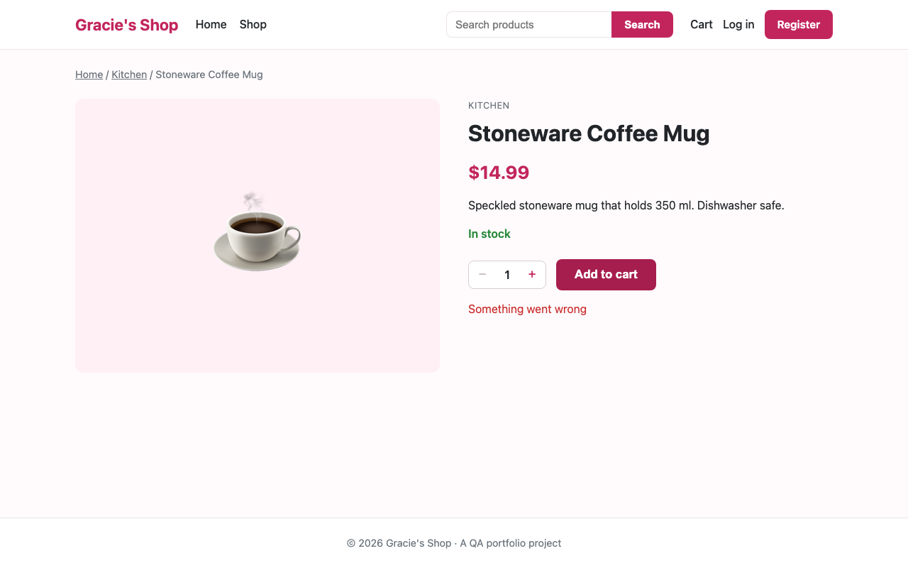

# BUG-001: "Add to cart" shows "Something went wrong" after the database is reset while a user is logged in

| Field | Value |
|---|---|
| **Bug ID** | BUG-001 |
| **Title** | "Add to cart" shows "Something went wrong" after the database is reset while a user is logged in |
| **Reported by** | Found during automation setup (Claude Code, reviewed by Gracie Bhandari) |
| **Date found** | 2026-10-04 |
| **Severity** | Low |
| **Priority** | Medium |
| **Status** | Open |
| **Related test case** | None yet. Found while preparing the manual test execution checklist. |
| **Environment** | macOS (Darwin 25.6.0), Node.js 24.20.0, Chromium (Playwright 1.62.1), 1280 × 800; app at commit `8a1deef` |

**Why Low severity:** it only happens when the database is reset (`npm run seed`) while the server is running and a user is logged in. Normal shoppers can't do that. **Why Medium priority:** testers reset the data often during manual testing (the test plan asks for it), so it will interrupt test sessions and could be mistaken for a different bug.

## Preconditions

- The server is running (`npm start`)
- A user registered during the session is logged in (for example QA User A, who gets user id 2)

## Steps to Reproduce

1. Register a new account (Name `QA User A`, Email `qa.usera@example.com`, Password `Password123`). The header shows "Hi, QA User A".
2. Leave the browser and the server running. In a second terminal, run `npm run seed`.
3. In the same browser, open the Stoneware Coffee Mug page (`/product.html?id=6`).
4. Click **Add to cart**.

## Expected Result

Because the account no longer exists, the user should be treated as logged out in every part of the app. Clicking **Add to cart** should send them to the Login page, the same as for any visitor (TC-CART-003).

## Actual Result

- After step 3, the header shows **Log in** and **Register**, so the user appears logged out.
- After step 4, the user stays on the product page and sees a red **"Something went wrong"** message. They are not sent to the Login page.
- The server log shows `Error: FOREIGN KEY constraint failed` at `server/routes/cart.js:79`.

The API behaves inconsistently for the same browser session:

| Request | Response |
|---|---|
| `GET /api/auth/me` | `200 {"user": null}` (logged out) |
| `GET /api/cart` | `200` with an empty cart (treated as logged in) |
| `POST /api/cart/items` | `500 {"error": "Something went wrong"}` |

## Evidence / Screenshot

The screenshot was captured by an automated reproduction script running the steps above in Chromium.

## Notes

- **Reproducibility:** always (reproduced through the API and in the browser).
- **Workaround:** after running `npm run seed`, log out in the browser (or clear cookies) and log in again.
- **Likely cause (from reading the code):** the session keeps the old user id. `GET /api/auth/me` checks that this user still exists in the database, but the `requireAuth` check used by the cart and orders routes ([server/middleware/requireAuth.js](../../server/middleware/requireAuth.js)) only checks that the session *has* a user id. The cart then tries to save an item for a user who no longer exists, and the database rejects it.
- **Possible fix (not applied, needs approval):** make `requireAuth` confirm the user still exists, and treat the request as logged out (`401`) if not.

## History

| Date | Status | Note |
|---|---|---|
| 2026-10-04 | Open | Reported. Reproduced through the API and in Chromium. |
